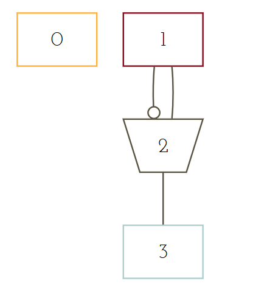
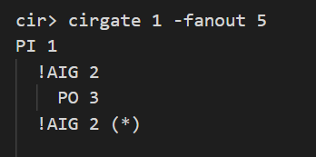

# Usage (Version 0)
## Requirements
- `python3`
- `numpy`
- `colordiff`

***
To install:  
```
sudo apt install python3
sudo apt install colordiff
pip3 install numpy
```
## How to run test
1. Put the following files in the same folder:
    - Your executable (eg. `cirTest`)
    - The reference program (eg. `cirTest-linux16`)
    - Bash script file `check`, `check_basic`
    - Test case generator `gen.py`, `gen_basic.py`
    - The .aag files folder `aag_files`
### Basic
1. It is advised that you first check all the basic commands listed below to ensure that the circuit is constructed correctly.
    ```
    cirread 
    cirprint -n
    cirprint -pi
    cirprint -po
    cirprint -fl
    cirwrite 
    ```

2. Go to the folder, on the terminal type:
    ```
    $ ./check_basic [platform]
    ```
    For example:
    ```
    $ ./check_basic linux16
    ```
    This would create basic dofiles (consisting of basic commands listed above) of all `.aag` files stored in the `basic_dofiles` folder. Outputs of your program and the reference program is then compared.

    The output files are stored in the folder `basic_outputs` for your reference.

### Intermediate
1. Add checking for `fanin` in `cirgate` command.
2. Go to the folder, on the terminal type:
    ```
    $ ./check [aag file] [number of test cases] [platform]
    ```
    For example:
    ```
    $ ./check C432.aag 1000 linux16
    ```
    This would generate a dofile `mydo` with basic testing and 1000 `cirgate -fanin` commands on the circuit defined in `C432.aag`. It then runs your program, runs the reference program, and compares the results.

    Outputs are `out.mine` and `out.ref` for your reference.

### To be updated
- `-fanout` list depends on the way you parse the aiger file. Currently the `-fanout` flag in `cirgate` command is not supported.

### Known bugs in reference program
- If a gate have both inverting an non-inverting fanouts, the reference program is unable to distinguish the fanouts.

|Circuit|Reference output|
|-------|----------------|
||